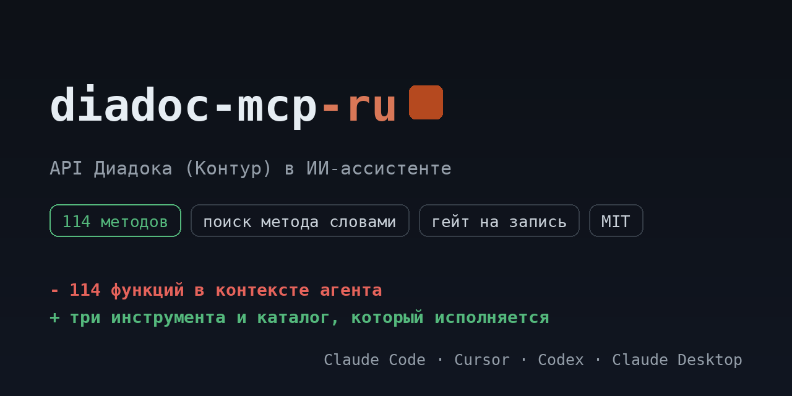

# diadoc-mcp-ru

<!-- mcp-name: io.github.ilyautov/diadoc-mcp-ru -->

API Диадока для ИИ-ассистентов: входящие и исходящие документы, статусы документооборота, контрагенты и приглашения к ЭДО, подписание, МЧД, печатные формы.

[](https://pypi.org/project/diadoc-mcp-ru/)
[](https://github.com/ilyautov/diadoc-mcp-ru/actions/workflows/ci.yml)
[](LICENSE)
[](#карта-методов)
[](https://business-mcp-ru.aifrontier.tech/diadoc-api.html)
[](https://github.com/ilyautov/diadoc-mcp-ru/stargazers)

[](https://vscode.dev/redirect/mcp/install?name=diadoc&config=%7B%22command%22%3A%20%22uvx%22%2C%20%22args%22%3A%20%5B%22diadoc-mcp-ru%22%5D%2C%20%22env%22%3A%20%7B%22DIADOC_CLIENT_ID%22%3A%20%22%24%7Binput%3Adiadoc_client_id%7D%22%2C%20%22DIADOC_TOKEN%22%3A%20%22%24%7Binput%3Adiadoc_token%7D%22%7D%7D&inputs=%5B%7B%22id%22%3A%20%22diadoc_client_id%22%2C%20%22type%22%3A%20%22promptString%22%2C%20%22description%22%3A%20%22%D0%98%D0%B4%D0%B5%D0%BD%D1%82%D0%B8%D1%84%D0%B8%D0%BA%D0%B0%D1%82%D0%BE%D1%80%20%D0%BF%D1%80%D0%B8%D0%BB%D0%BE%D0%B6%D0%B5%D0%BD%D0%B8%D1%8F%20%D0%94%D0%B8%D0%B0%D0%B4%D0%BE%D0%BA%2C%20%D0%B2%D1%8B%D0%B4%D0%B0%D1%91%D1%82%20%D0%9A%D0%BE%D0%BD%D1%82%D1%83%D1%80.%22%7D%2C%20%7B%22id%22%3A%20%22diadoc_token%22%2C%20%22type%22%3A%20%22promptString%22%2C%20%22description%22%3A%20%22%D0%A2%D0%BE%D0%BA%D0%B5%D0%BD%20%D0%BF%D0%BE%D0%BB%D1%8C%D0%B7%D0%BE%D0%B2%D0%B0%D1%82%D0%B5%D0%BB%D1%8F%20%D0%94%D0%B8%D0%B0%D0%B4%D0%BE%D0%BA%2C%20%D0%B2%D1%8B%D0%B4%D0%B0%D1%91%D1%82%20%D0%BC%D0%B5%D1%82%D0%BE%D0%B4%20Authenticate.%22%2C%20%22password%22%3A%20true%7D%5D)
[](https://cursor.com/en/install-mcp?name=diadoc&config=eyJjb21tYW5kIjogInV2eCIsICJhcmdzIjogWyJkaWFkb2MtbWNwLXJ1Il0sICJlbnYiOiB7IkRJQURPQ19DTElFTlRfSUQiOiAiIiwgIkRJQURPQ19UT0tFTiI6ICIifX0=)

<p align="center">
  <a href="https://business-mcp-ru.aifrontier.tech/">
    
  </a>
</p>

Каталог собран из первоисточника (документация `developer.kontur.ru/doc/diadoc-api`) и лежит в репозитории как
`diadoc_mcp/endpoints.yaml`: **114 методов**, из них 78 на чтение,
29 на запись и 7 необратимых. Сервер исполняет ровно этот файл,
поэтому таблица ниже не может разойтись с кодом.

## Установка

```bash
uvx diadoc-mcp-ru
```

Claude Desktop, `claude_desktop_config.json`:

```json
{
  "mcpServers": {
    "diadoc-mcp": {
      "command": "uvx",
      "args": ["diadoc-mcp-ru"],
      "env": { "DIADOC_CLIENT_ID": "...", "DIADOC_TOKEN": "..." }
    }
  }
}
```

## Ключи

Идентификатор приложения запрашивается у Контура письмом, для продуктива нужна лицензия, для проб есть тестовый контур. Токен пользователя выдаёт метод Authenticate по логину и паролю или по сертификату.

| переменная | секрет | что это |
|---|---|---|
| `DIADOC_CLIENT_ID` | нет | Идентификатор приложения Диадок, выдаёт Контур. |
| `DIADOC_TOKEN` | да | Токен пользователя Диадок, выдаёт метод Authenticate. |

Ключи можно не держать в окружении: сервер умеет кабинеты и кладёт их в
`~/.ru-mcp/cabinets.json` с правами 600, вне репозитория.

## Карта методов

| раздел | методов | чтение | запись | необратимое |
|---|---|---|---|---|
| Документы | 17 | 10 | 5 | 2 |
| Контрагенты | 14 | 8 | 4 | 2 |
| Сотрудники и пользователи | 14 | 8 | 4 | 2 |
| Сообщения | 11 | 6 | 5 | 0 |
| Организации и ящики | 11 | 9 | 2 | 0 |
| Машиночитаемая доверенность | 8 | 4 | 3 | 1 |
| Подписание | 8 | 6 | 2 | 0 |
| Генерация и разбор XML | 8 | 8 | 0 | 0 |
| События | 7 | 6 | 1 | 0 |
| Печатные формы | 6 | 6 | 0 | 0 |
| Полка документов | 6 | 3 | 3 | 0 |
| Документооборот | 4 | 4 | 0 | 0 |
| **всего** | **114** | **78** | **29** | **7** |

## Как это выглядит в чате

Вы: входящие документы

```
diadoc_search_methods("входящие документы")
  diadoc_get_document          GET  /V3/GetDocument      чтение
  diadoc_get_documents         GET  /V3/GetDocuments     чтение
  diadoc_get_document_actions  GET  /GetDocumentActions  чтение

diadoc_describe_method("diadoc_get_document")
  Возвращает данные документа по указанному идентификатору.
  GET diadoc-api.kontur.ru/V3/GetDocument
  параметры: нет
  класс доступа: чтение

diadoc_call_method("diadoc_get_document", {})
```

Три инструмента вместо 114 функций: агент ищет метод словами,
читает его карточку и вызывает. Запись и необратимое спрашивают подтверждение.

Что обычно просят:

- Показать входящие документы, по которым нужно действие.
- Свести документооборот с контрагентом за период.
- Найти контрагента по ИНН и КПП и проверить, подключён ли он к ЭДО.
- Скачать печатную форму документа для бухгалтерии.

## Безопасность

Сервер работает на машине пользователя, ключи наружу не уходят. У методов три
класса доступа: чтение идёт сразу, запись и необратимые действия требуют
подтверждения. Заголовок авторизации не покидает домены сервиса даже при вызове
произвольного пути.

## Проверить установку

```bash
uvx diadoc-mcp-ru doctor
```

Печатает, сколько методов загрузилось, найдены ли ключи и откуда. Секреты не
показывает. С `--live` делает один дешёвый реальный вызов на чтение.

## Родня

Ядро вынесено в [schema-mcp-core](https://github.com/ilyautov/schema-mcp-core).
Соседние серверы: [hh-mcp-ru](https://github.com/ilyautov/hh-mcp-ru), [vk-mcp-ru](https://github.com/ilyautov/vk-mcp-ru), [sbis-mcp-ru](https://github.com/ilyautov/sbis-mcp-ru), [chestny-znak-mcp-ru](https://github.com/ilyautov/chestny-znak-mcp-ru).
Маркетплейсы живут отдельно: [marketplaces-mcp-ru](https://github.com/ilyautov/marketplaces-mcp-ru).

MIT. Автор [Илья Утов](https://github.com/ilyautov).
